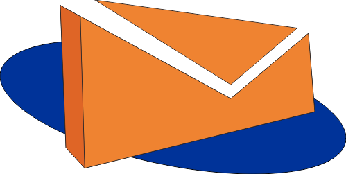

<!--
Hey, thanks for using the awesome-readme-template template.
If you have any enhancements, then fork this project and create a pull request
or just open an issue with the label "enhancement".

Don't forget to give this project a star for additional support ;)
Maybe you can mention me or this repo in the acknowledgements too
-->
<div align="center">

  
  <h1>E-letter</h1>
  
  <p>
    Web-based correspondence archiving application, built using the Flask.
  </p>
  
  
<!-- Badges -->
<p>
  <a href="https://github.com/magang-brida-2022/surat-menyurat/graphs/contributors">
    
  </a>
  <a href="">
    
  </a>
  <a href="https://github.com/magang-brida-2022/surat-menyurat/network/members">
    
  </a>
  <a href="https://github.com/magang-brida-2022/surat-menyurat/stargazers">
    
  </a>
  <a href="https://github.com/magang-brida-2022/surat-menyurat/issues/">
    
  </a>
  <a href="https://github.com/magang-brida-2022/surat-menyurat/blob/master/LICENSE">
    
  </a>
</p>
   
<h4>
    <a href="#demo">View Demo</a>
  <span> · </span>
    <a href="https://github.com/magang-brida-2022/surat-menyurat/issues/">Report Bug</a>
  </h4>
</div>

<br />

<!-- Table of Contents -->

# :notebook_with_decorative_cover: Table Of Content

- [About the Project](#star2-about-the-project)
  - [Screenshots](#camera-screenshots)
  - [Tech Stack](#space_invader-tech-stack)
  - [Features](#dart-features)
  - [Environment Variables](#key-environment-variables)
- [Getting Started](#toolbox-getting-started)
  - [Prerequisites](#bangbang-prerequisites)
  - [Run Locally](#running-run-locally)
  <!-- About the Project -->

## :star2: About the Project

<!-- Screenshots -->

### :camera: Screenshots

<div align="center"> 
  
</div>

<!-- TechStack -->

### :space_invader: Tech Stack

  <ul>
    <li><a href="https://www.python.org/">Python</a></li>
    <li><a href="https://flask.palletsprojects.com/">Flask</a></li>
    <li><a href="https://getbootstrap.com/">Bootstrap</a></li>
    <li><a href="https://www.postgresql.org/">Postgresql</a></li>
  </ul>

<!-- Features -->

### :dart: Features

- Dashboard
- Surat Masuk & Surat Keluar
- Surat Balasan
- Aktifitas Harian
- Agenda Harian
- Disposisi
- Admin

<!-- Env Variables -->

### :key: Environment Variables

To run this project, you will need to add the following environment variables to your .env file

`IS_ADMIN` <br>
`FLASK_APP` <br>
`FLASK_DEBUG`

<!-- Getting Started -->

## :toolbox: Getting Started

<!-- Run Locally -->

### :running: Run Locally

Clone the project

```bash
  git clone https://github.com/magang-brida-2022/surat-menyurat.git
```

Go to the project directory

```bash
  cd surat-menyurat
```

Install dependencies

```bash
  pip install -r requirements.txt
```

Start the server

```bash
  flask run
```
